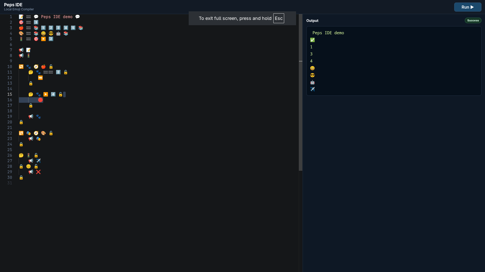

# Peps
Peps is an emoji-first programming language with:
- a Rust compiler/runtime for `.peps` files
- a local browser IDE powered by the same runtime

## Language Rules (Current)

1. Statements are separated by **new lines**.
2. `🔚` is optional and not required.
3. Variable identifiers must be **exactly one emoji**.
4. `break` (`🛑`) and `continue` (`⏭️`) are valid only inside loops.
5. Loop blocks use this structure:

```peps
🔁 ✅ 🔓
    ⏭️
    🛑
🔒
```

## Core Syntax

| Emoji | Meaning | Example |
| --- | --- | --- |
| 📢 | print | `📢 🐶` |
| 🤔 | if | `🤔 ✅ 🔓` |
| 😐 | else | `🔒 😐 🔓` |
| 🔁 | while / for | `🔁 ✅ 🔓`, `🔁 🐾 🧭 🍎 🔓` |
| 🛑 | break | `🛑` |
| ⏭️ | continue | `⏭️` |
| 🧭 | in (for loops) | `🔁 🐾 🧭 🍎 🔓` |
| 🔢 | range | `🔁 🐾 🧭 🔢 0️⃣ ➡️ 3️⃣ 🔓` |
| 🟰 | assign | `🐶 🟰 5️⃣` |
| 🔓 / 🔒 | block start / end | `🤔 ✅ 🔓 ... 🔒` |
| 💬 | string delimiter | `🐶 🟰 💬hello💬` |
| 📚 | list delimiter | `🍎 🟰 📚 1️⃣ 2️⃣ 3️⃣ 📚` |

## Example

```peps
🍎 🟰 📚 1️⃣ 2️⃣ 3️⃣ 📚
🔁 🐾 🧭 🍎 🔓
    📢 🐾
🔒
```

## Run a `.peps` File

```sh
cargo run -- examples/basic.peps
```

## Start IDE

```sh
sh scripts/ide/build.sh
./dist/ide/linux/peps-ide-x86_64.AppImage
```

Then open: `http://127.0.0.1:5179`

## One-command Helpers

Linux/macOS:

```sh
sh scripts/build-run.sh compiler
sh scripts/build-run.sh ide
sh scripts/build-run.sh all
```

Linux build artifacts are written to:
- `dist/compiler/linux/linux.sh`
- `dist/compiler/linux/peps!`
- `dist/compiler/linux/peps!-bytecode`
- `dist/compiler/linux/peps-compiler-x86_64.AppImage`
- `dist/ide/linux/peps-ide-x86_64.AppImage`

Windows PowerShell:

```powershell
.\scripts\build-run.ps1 compiler
.\scripts\build-run.ps1 ide
.\scripts\build-run.ps1 all
```

Windows build artifacts are written to:
- `dist\compiler\windows\peps!.exe`
- `dist\ide\windows\peps-ide.exe`

Cross-build Windows `.exe` files from Linux:

```sh
sh scripts/build-windows.sh
```

Requires:
- `x86_64-w64-mingw32-gcc`
- Rust target `x86_64-pc-windows-gnu`

### IDE Preview

