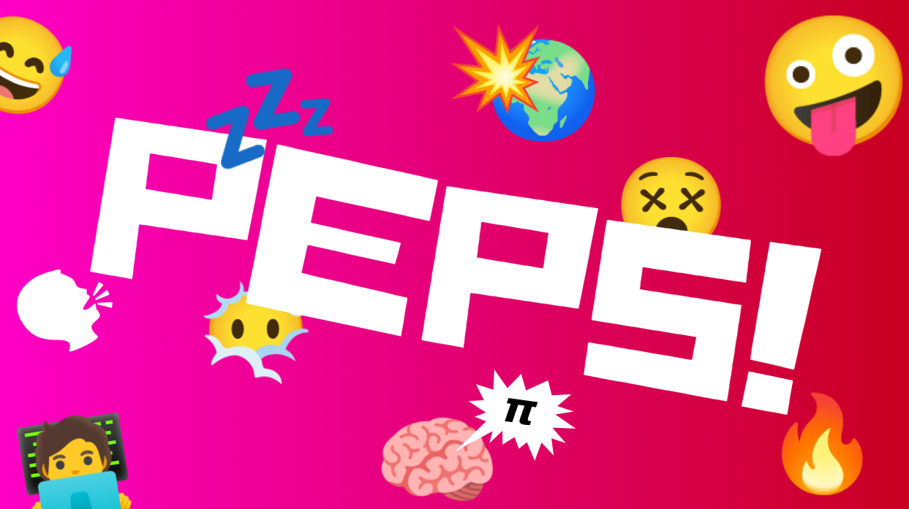

# Peps
Peps is an emoji-first programming language. This project includes a compiler and
a small bytecode runner for local `.peps` files.

Public re-exports keep convenient paths such as `peps::lexer::lex`,
`peps::compile_source`, and `peps::run_source` available.

## Syntax Reference

| Emoji | Name | Meaning | Example |
| --- | --- | --- | --- |
| 📢 | print | Print an expression | `📢 🐶 🔚` |
| 🤔 | if | Start an if statement | `🤔 🐶 🔓` |
| 😐 | else | Start an else block | `🔒 😐 🔓` |
| 🔁 | loop | Start a while loop or for loop | `🔁 🐶 🔓`, `🔁 🐾 🧭 🍎 🔓` |
| 🧭 | in | Separates for-loop item from source | `🔁 🐾 🧭 🍎 🔓` |
| 🔢 | range | Starts a numeric range source | `🔁 🐾 🧭 🔢 0️⃣ ➡️ 3️⃣ 🔓` |
| ✅ | true | Boolean true | `🐶 🟰 ✅ 🔚` |
| ❌ | false / not-equal prefix | Boolean false, or part of `❌🟰` | `🐶 🟰 ❌ 🔚` |
| 🟰 | assign | Assign once / declare variable | `🐶 🟰 5️⃣ 🔚` |
| ➕ | add | Numeric addition | `1️⃣ ➕ 2️⃣` |
| ➖ | subtract / negate | Numeric subtraction or negative number | `5️⃣ ➖ 2️⃣`, `➖5️⃣` |
| ✖️ | multiply | Numeric multiplication | `2️⃣ ✖️ 3️⃣` |
| ➗ | divide | Numeric division | `6️⃣ ➗ 2️⃣` |
| 🟰🟰 | equals | Equality comparison | `🐶 🟰🟰 5️⃣` |
| ❌🟰 | not equals | Inequality comparison | `🐶 ❌🟰 5️⃣` |
| ◀️ | less than | Numeric less-than comparison | `2️⃣ ◀️ 3️⃣` |
| ▶️ | greater than | Numeric greater-than comparison | `5️⃣ ▶️ 3️⃣` |
| ◀️🟰 | less or equal | Numeric less-than-or-equal comparison | `2️⃣ ◀️🟰 3️⃣` |
| ▶️🟰 | greater or equal | Numeric greater-than-or-equal comparison | `5️⃣ ▶️🟰 3️⃣` |
| ➡️ | range end | Separates range start and end | `🔢 0️⃣ ➡️ 3️⃣` |
| 🔓 | block start | Open an if/else/while block | `🤔 ✅ 🔓` |
| 🔒 | block end | Close a block | `🔒` |
| 🔚 | statement end | End an assignment or print statement | `📢 🐶 🔚` |
| 💬 | string delimiter | Wrap string content | `🐶 🟰 💬hello💬 🔚` |
| 📚 | list delimiter | Start and end a list | `📚 1️⃣ 2️⃣ 📚` |
| 0️⃣ ... 9️⃣ | digits | Whole-number digits | `1️⃣2️⃣3️⃣` |
| any other single emoji | variable or emoji literal | Variable name, or literal on assignment RHS | `📦 🟰 🥊 🔚` |

## Loop Examples

For each item in a list:

```peps
🍎 🟰 📚 1️⃣ 2️⃣ 3️⃣ 📚 🔚

🔁 🐾 🧭 🍎 🔓
    📢 🐾 🔚
🔒
```

For each number in a range. The end is exclusive, so this prints `0`, `1`, `2`:

```peps
🔁 🐾 🧭 🔢 0️⃣ ➡️ 3️⃣ 🔓
    📢 🐾 🔚
🔒
```

While loops still use `🔁 condition`:

```peps
🌙 🟰 ❌ 🔚

🔁 🌙 🔓
    📢 🌙 🔚
🔒
```

## Running Peps Files

Peps source files use the `.peps` extension. The runner compiles the file to
bytecode, runs it, and prints the program output.

Create a file, for example `hello.peps`:

```peps
🐶 🟰 💬hello peps💬 🔚
📢 🐶 🔚
```

If you are working inside this Rust project, run a file with Cargo:

```sh
cargo run -- hello.peps
```

Run the included example the same way:

```sh
cargo run -- examples/basic.peps
```

After building the standalone binary, run a file without Cargo:

```sh
'./dist/compiler/peps!' hello.peps
```

If `peps!` is installed on your `PATH`, run files like this:

```sh
'peps!' hello.peps
```

Compiler or runtime errors are printed with diagnostics. Valid programs print
only the program output.

## Local IDE

The Peps IDE is a separate local web app. It does not contain its own compiler:
the browser sends source text to the Rust IDE server, and the server calls the
same `peps::run_source` API used by the normal runner.

Build the frontend once:

```sh
cd ide
npm install
npm run build
cd ..
```

Start the IDE server:

```sh
cargo run --bin peps-ide
```

Then open:

```text
http://127.0.0.1:5179
```

For frontend-only development, you can also run Vite separately:

```sh
cd ide
npm run dev
```

## Build the Compiler Runner

On Linux or macOS:

```sh
sh scripts/compiler/build.sh
'./dist/compiler/peps!' examples/basic.peps
```

To run it as `peps! basic.peps` from any folder, copy the binary into a folder on
your `PATH`:

```sh
mkdir -p "$HOME/.local/bin"
cp 'dist/compiler/peps!' "$HOME/.local/bin/peps!"
'peps!' examples/basic.peps
```

On Windows PowerShell:

```powershell
.\scripts\compiler\build.ps1
.\dist\compiler\peps!.exe examples\basic.peps
```

The machine that builds the binary needs Rust. The machine that runs the copied
`dist/compiler/peps!` or `dist\compiler\peps!.exe` binary does not need Rust
installed.

## Build the Local IDE

The IDE build is separate from the compiler runner build. It contains:

- `peps-ide` / `peps-ide.exe` plus built web assets for the local browser IDE

The IDE server still depends on the Peps compiler/runtime library internally, but
the packaged IDE output does not include the standalone `peps!` runner. Build the
runner separately with `scripts/compiler`.

The machine that builds the IDE needs Rust and Node/npm. The machine that runs
the finished IDE package does not need Rust or npm.

On Linux or macOS:

```sh
sh scripts/ide/build.sh
./dist/ide/peps-ide.sh
```

On Windows PowerShell:

```powershell
.\scripts\ide\build.ps1
.\dist\ide\peps-ide.exe
```

The IDE starts at:

```text
http://127.0.0.1:5179
```
