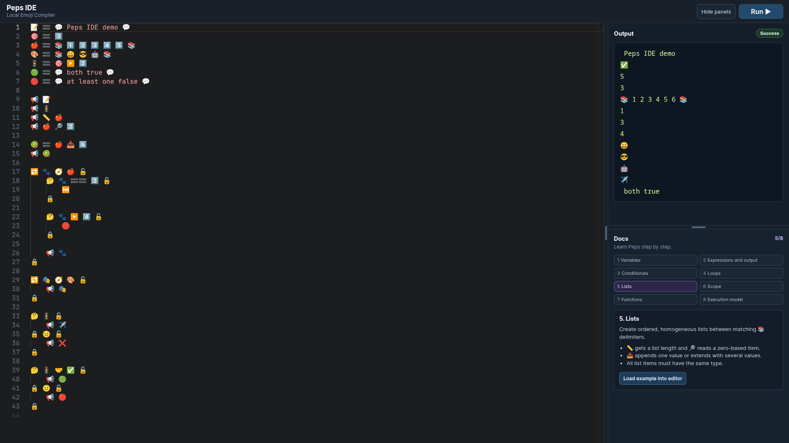

Peps is an emoji-first programming language with a Rust compiler/runtime for
`.peps` files and a local browser IDE powered by the same runtime.

## Get Started

Follow the guides in order. Every guide has a matching runnable program in
[`examples/basic/`](examples/basic/).

1. [Variables](docs/01-variables.md) 
2. [Expressions and output](docs/02-expressions-and-output.md)
3. [Conditionals](docs/03-conditionals.md) 
4. [Loops](docs/04-loops.md)
5. [Lists](docs/05-lists.md) 
6. [Scope](docs/06-scope.md) 
7. [Functions](docs/07-functions.md) 
8. [Execution model](docs/08-execution-model.md)
9. [Input](docs/09-input.md)
10. [Type conversion](docs/10-type-conversion.md)
11. [Maps](docs/11-maps.md)
12. [Text operations](docs/12-text-operations.md)
13. [Constants](docs/13-constants.md)
14. [Map key existence](docs/14-map-key-existence.md)

## Examples

- [Basic examples](examples/basic/) progress from variables to map key checks.
- [Algorithms](examples/algorithms/) contains five well-known algorithms
  recreated in Peps.

## Core Syntax

| Emoji | Meaning | Example |
| --- | --- | --- |
| 📢 | print | `📢 🐶` |
| 🤔 | if | `🤔 ✅ 🔓` |
| 😐 | else | `🔒 😐 🔓` |
| 🔁 | while / for . in . | `🔁 ✅ 🔓`, `🔁 🐾 🧭 🍎 🔓` |
| 🛑 | break | `🛑` |
| ⏭️ | continue | `⏭️` |
| 🧩 | define function | `🧩 🧮 📚 🐶 🐱 📚 🔓 ... 🔒` |
| 📞 | call function | `📞 🧮 📚 1️⃣ 2️⃣ 📚` |
| ↩️ | return from function | `↩️ 🐶 ➕ 🐱` |
| ⌨️ | read typed input | `🐶 🟰 ⌨️ 🔢` |
| 🔤 / 🔢 / 🔣 / ☑️ | text / integer / float / boolean input type | `📝 🟰 ⌨️ 🔤` |
| 🔄 | explicit numeric conversion | `🐶 🟰 🔄 🔢 📝`, `🦊 🟰 🔄 🔣 🐶` |
| 🔐 | declare read-only constant | `🔐 🐶 🟰 4️⃣2️⃣` |
| 🗺️ | map delimiter | `📖 🟰 🗺️ 💬year💬 ➡️ 2️⃣0️⃣2️⃣6️⃣ 🗺️` |
| ➡️ | range end / map key-value separator | `🔢 0️⃣ ➡️ 3️⃣`, `💬name💬 ➡️ 💬Peps💬` |
| 🧭 | in (for loops) | `🔁 🐾 🧭 🍎 🔓` |
| 🔢 | range | `🔁 🐾 🧭 🔢 0️⃣ ➡️ 3️⃣ 🔓` |
| 🟰 | assign | `🐶 🟰 5️⃣` |
| `.` | float decimal separator | `1️⃣.5️⃣` |
| ➕ | add / text concat | `1️⃣ ➕ 2️⃣`, `💬hi💬 ➕ 💬there💬` |
| ➖ | subtract / negate | `5️⃣ ➖ 2️⃣`, `➖5️⃣`, `➖1️⃣.5️⃣` |
| ✖️ | multiply | `2️⃣ ✖️ 3️⃣` |
| ➗ | divide | `6️⃣ ➗ 2️⃣` |
| ▶️ / ◀️ | greater / less than | `5️⃣ ▶️ 3️⃣`, `2️⃣ ◀️ 4️⃣` |
| ▶️🟰 / ◀️🟰 | greater-or-equal / less-or-equal | `5️⃣ ▶️🟰 5️⃣` |
| 🟰🟰 / ❌🟰 | equal / not equal | `✅ 🟰🟰 ✅` |
| 📏 | text length / collection size | `📏 📝`, `📏 🍎`, `📏 📖` |
| 🔎 | text/list index or map lookup | `📝 🔎 0️⃣`, `🍎 🔎 1️⃣`, `📖 🔎 💬name💬` |
| 🔑 | map key exists | `🔑 📖 💬name💬` |
| 📥 | list append / map merge | `🍎 📥 4️⃣`, `📖 📥 🗺️ 💬users💬 ➡️ 4️⃣2️⃣ 🗺️` |
| 🔓 / 🔒 | block start / end | `🤔 ✅ 🔓 ... 🔒` |
| 💬 | string delimiter | `🐶 🟰 💬hello💬` |
| 📚 | list delimiter | `🍎 🟰 📚 1️⃣ 2️⃣ 3️⃣ 📚` |
| `//` | line comment | `📢 1️⃣ // ignored` |
| `🤝` / `🔀` / `🚫` | logical operators (AND/OR/NOT) | `✅ 🤝 ❌` |

## Development and releases

Commands for running examples, testing, browser IDE development, packaging,
and releases are kept in one place: [Development, Testing, and
Releases](docs/README.md).

On Linux, run the complete local release build with:

```sh
sh scripts/build-all.sh
```

It checks formatting, Rust tests, Clippy, and IDE tests before building the
local development container plus Linux and Windows compiler and IDE artifacts.
It does not upload the container or release files.

### IDE Preview


