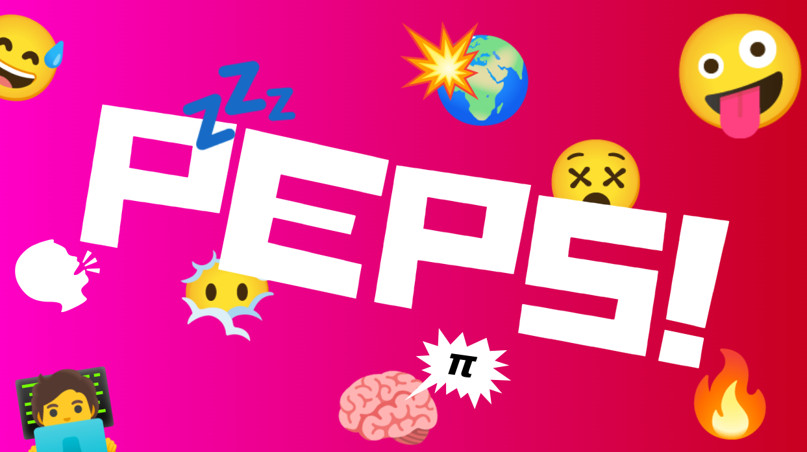
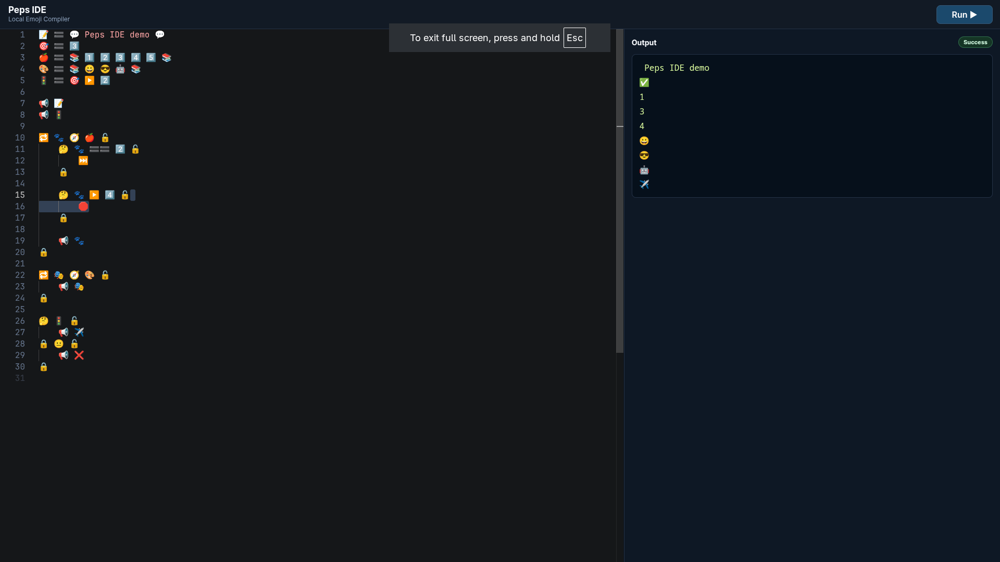

Peps is an emoji-first programming language with a Rust compiler/runtime for
`.peps` files and a local browser IDE powered by the same runtime.

## Get Started

Follow the guides in order. Every guide has a matching runnable program in
[`examples/`](examples/).

1. [Variables](docs/01-variables.md) — [`examples/01-variables.peps`](examples/01-variables.peps)
2. [Expressions and output](docs/02-expressions-and-output.md) — [`examples/02-expressions-and-output.peps`](examples/02-expressions-and-output.peps)
3. [Conditionals](docs/03-conditionals.md) — [`examples/03-conditionals.peps`](examples/03-conditionals.peps)
4. [Loops](docs/04-loops.md) — [`examples/04-loops.peps`](examples/04-loops.peps)
5. [Lists](docs/05-lists.md) — [`examples/05-lists.peps`](examples/05-lists.peps)
6. [Scope](docs/06-scope.md) — [`examples/06-scope.peps`](examples/06-scope.peps)
7. [Functions](docs/07-functions.md) — [`examples/07-functions.peps`](examples/07-functions.peps)
8. [Execution model](docs/08-execution-model.md) — [`examples/08-execution-model.peps`](examples/08-execution-model.peps)

Run any example from the project root:

```sh
cargo run -- examples/01-variables.peps
```

## Core Syntax

| Emoji | Meaning | Example |
| --- | --- | --- |
| 📢 | print | `📢 🐶` |
| 🤔 | if | `🤔 ✅ 🔓` |
| 😐 | else | `🔒 😐 🔓` |
| 🔁 | while / for . in . | `🔁 ✅ 🔓`, `🔁 🐾 🧭 🍎 🔓` |
| 🛑 | break | `🛑` |
| ⏭️ | continue | `⏭️` |
| 🧩 | define function | `🧩 🧮 📚 🐶 🐱 📚 🔓 ... 🔒` |
| 📞 | call function | `📞 🧮 📚 1️⃣ 2️⃣ 📚` |
| ↩️ | return from function | `↩️ 🐶 ➕ 🐱` |
| 🧭 | in (for loops) | `🔁 🐾 🧭 🍎 🔓` |
| 🔢 | range | `🔁 🐾 🧭 🔢 0️⃣ ➡️ 3️⃣ 🔓` |
| 🟰 | assign | `🐶 🟰 5️⃣` |
| ➕ | add / text concat | `1️⃣ ➕ 2️⃣`, `💬hi💬 ➕ 💬there💬` |
| ➖ | subtract | `5️⃣ ➖ 2️⃣` |
| ✖️ | multiply | `2️⃣ ✖️ 3️⃣` |
| ➗ | divide | `6️⃣ ➗ 2️⃣` |
| ▶️ / ◀️ | greater / less than | `5️⃣ ▶️ 3️⃣`, `2️⃣ ◀️ 4️⃣` |
| ▶️🟰 / ◀️🟰 | greater-or-equal / less-or-equal | `5️⃣ ▶️🟰 5️⃣` |
| 🟰🟰 / ❌🟰 | equal / not equal | `✅ 🟰🟰 ✅` |
| 📏 | list length | `📏 🍎` |
| 🔎 | list index | `🍎 🔎 1️⃣` |
| 📥 | list append / extend | `🍎 📥 4️⃣`, `🍎 📥 4️⃣ 5️⃣`, `🥝 🟰 🍎 📥 6️⃣ 5️⃣` |
| 🔓 / 🔒 | block start / end | `🤔 ✅ 🔓 ... 🔒` |
| 💬 | string delimiter | `🐶 🟰 💬hello💬` |
| 📚 | list delimiter | `🍎 🟰 📚 1️⃣ 2️⃣ 3️⃣ 📚` |
| `//` | line comment | `📢 1️⃣ // ignored` |
| `🤝` / `🔀` / `🚫` | logical operators (AND/OR/NOT) | `✅ 🤝 ❌` |

## Run, Test, and Build

Run a file with `cargo run -- path/to/program.peps`.

```sh
cargo test
cd ide && pnpm test && pnpm run build
```

Start the IDE:

```sh
sh scripts/ide/build.sh
./dist/ide/linux/peps-ide-x86_64.AppImage
```

Then open `http://127.0.0.1:5179`.

One-command helpers are available through `scripts/build-run.sh` on Linux/macOS
and `scripts/build-run.ps1` on Windows. The compiler package contains `peps`
on Linux and `peps.exe` on Windows.

### IDE Preview


